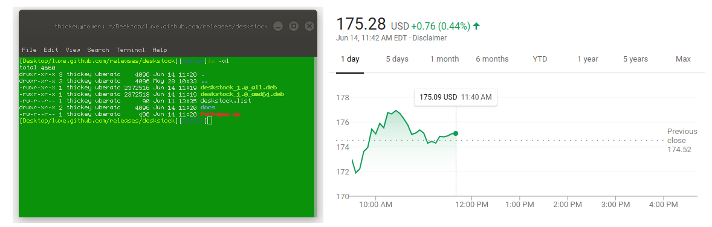
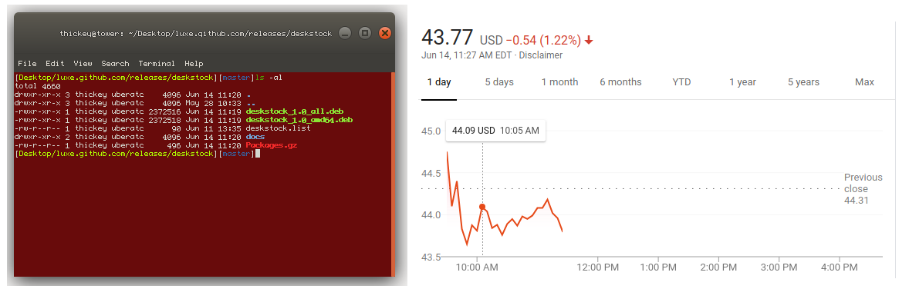

% deskstock
% Feel the stock market
% August 2, 2019


# Introduction
Deskstock is a tool that monitors changing values over time.  It adjusts your system to reflect the changing value in fun and potentially useful ways.  Don't just watch a value change; have it grow or shrink your mouse cursor.  Have it change the color of your terminal or play sound effects when certain values are reached.  There are different ways to "source" values for monitoring, and lots of built in "effects" to perform on the monitored values.  You can customize how frequently observations and changes are performed on your system.  The tool is designed to be run in the background and reflect changes to you throughout the day.  Write your own configurations and share them with others.  Here is an example of changing the terminal color based on a chosen stock.  A green terminal when stocks are up.  


A red terminal when stocks are down.  



# Installation
Software can be installed through apt-get.  The following commands will add the ppa and install the software.  
```
sudo curl -s --compressed -o /etc/apt/sources.list.d/deskstock.list 'https://raw.githubusercontent.com/luxe/luxe.github.com/master/releases/deskstock/deskstock.list'
sudo apt update
sudo apt install deskstock

```
The debian file can also be installed/uninstalled directly.  To uninstall you can use:  
```
sudo apt remove deskstock
```


# Configuration
All configuration for deskstock will be found in your home directory inside the file **.deskstock**.  This is a json file that will be automatically reloaded by the program upon saving.  Go ahead, you can adjust this configuration while the program is running, and it will pick up the changes in real-time.  If you specify malformed json, or your json does not match the schema known to the program, it will tell you.  The best way to fix this, is to simply delete the configuration file.  The program will automatically re-create it with a valid default configuration.  A word of warning on how you configure things.  Deskstock does not apply any artificial restrictions.  If you want to ping a sever every millisecond, or spawn an infinite amount of processes you can.  Its up to you to configure things that are sensible on your machine.  In the following sections, we will cover more specifically the different areas of configuration.  


## Startup
Startup configurations refer to any initial provisioning that needs to take place as soon as deskstock starts.  Configurations related to the program startup looks as followed.  
```
{
  "locale": {
    "cout": "en_US.UTF-8",
    "global": "en_US.UTF-8",
    "set": true
  },
  "needed_programs": {
    "check": true,
    "programs": [
      "redshift",
      "dconf"
    ]
  }
}
```
The **locale** of the program can be changed depending on the user's language and region.  Disable the **set** flag if you don't want to configure the locale at all.  In this case, your system's default will be used.  **needed programs** are additional programs that deskstock will call for you on your behalf when monitoring and effecting.  If you want to ensure the user has these programs available, specify them here.  Deskstock will error out if a program is listed but cannot be found.  This is useful if you write custom rules that rely on programs which might not exist on other people's machines.  Disable the **check** flag if you don't want to check for additional programs.  These effects only take place on program startup.  Unlike other configurations, the program will need restarted for the settings to take effect.  


## Monitoring
Monitoring configurations refer to how deskstock monitors values and when it decides to perform effects.  Configurations related to monitoring looks as followed.  
```
{
  "ms_to_fetch_changing_data": 1000,
  "only_on_change": true
}
```
Deskstock runs in an infinite loop where it sources data and decides whether to effect the system.  You can configure how long it sleeps between each iteration with **ms_to_fetch_changing_data**.  Usually, deskstock will only effect the system when it discovers the value has changed from what it was previously.  If you want to perform the effect again (despite the value having not changed), you can disable **only_on_change**.  Depending on how you source values, and what kind of effects you perform on your system, be careful about settings the fetch rate too quick.  


## Sourcing
What value or set of values do you want to monitor?  Sourcing refers to the configuration you can use to specify how your value(s) will be monitored.  Each section below shows different ways you can enable sourcing for particular values.  


### Through a Web Endpoint
Sourcing values through a web endpoint is possible assuming the endpoint returns json.  Below is an example configuration that sources today's percentage change on UBER stock.  
```
{
  "extract": {
    "desired_key": "regularMarketChangePercent",
    "steps": [
      {
        "index": false,
        "key": "quoteResponse"
      },
      {
        "index": false,
        "key": "result"
      },
      {
        "index": true,
        "key": "0"
      }
    ]
  },
  "fetch": {
    "headers": [],
    "post": false,
    "seconds_till_timeout": 10,
    "show_errors": false,
    "strategy": 0,
    "url": "https://query1.finance.yahoo.com/v7/finance/quote?lang=en-US&region=US&corsDomain=finance.yahoo.com&symbols=UBER"
  }
}
```
The fetch url is the endpoint where json is sourced from.  Different strategies for fetching can be used internally by deskstock.  Strategy 0 will use the curl library directly. strategy 1 will call the actual curl cli program.  **desired_key** and **steps** are used to extract a value from the returned json payload.  Each step of extraction may require indexing with a number or accessing a key.  If its a key name, set index to false and provide the name.  If you need to index into an array, set index to true and provide an index number (as a string).  The extraction steps take place in the order they are specified.  


### Through Simulation
Sometimes you need to test your effects to see what they will look like.  Its not always possible to wait for your values to change from your configured source.  We mitigate this by allowing you to temporarily switch to a simulated source.  Simulation will allow you to cycle through a set of values in a predictable way.  Once you are happy with what the effects look like on your specified examples, you can switch back to using a different source.  Below is an example configuration for simulating over a set of test values.  
```
{
  "cycled_values": [
    0.0,
    1.0,
    2.0,
    3.0,
    4.0,
    -1.0,
    -2.0,
    -3.0,
    -4.0
  ],
  "simulate": true
}
```
This allows the user to experiment with the effects configuration in realtime.  When the last value in the list is provided, it will start back over at the beginning of the list.  


### Through Mouse
You can source the x and y mouse coordinates and use them as your changing values.  Below shows the typical configuration for mouse sourcing.  
```
{
  "enable": true
}
```


### Through Custom
The flood gates are open so you can source values through any custom scripts or programs you want.  Specify any command which you can execute from your shell.  As long as the program outputs whitespace separated values to stdout they will be monitored by deskstock.  Below is an example that takes the current seconds of the minute and mods it by 5 to get different values.  
```
{
  "enable": true,
  "user_commands": [
    "expr `date +%S` % 5"
  ]
}
```


## Effects
Once you are sourcing values, there are various ways to effect the system based on the changing value(s).  

