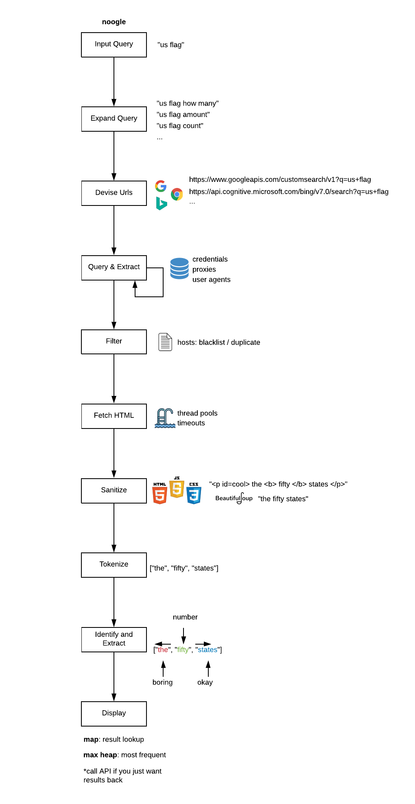

% noogle
% Like google but you get back numbers
% July 23, 2019


# Introduction
Noogle is like google but you get back numbers.  It runs various search engines, culminates the data, and provides you the most common numerical results shared across various websites.  For example, if you noogled 'us flag' you'd expect to get back 50 states.  If you noogled 'snow white' you'd expect to get back 7 dwarfs.  


# Installation
Software can be installed through apt-get.  The following commands will add the ppa and install the software.  
```
sudo curl -s --compressed -o /etc/apt/sources.list.d/noogle.list 'https://raw.githubusercontent.com/luxe/luxe.github.com/master/releases/noogle/noogle.list'
sudo apt update
sudo apt install noogle

```
The debian file can also be installed/uninstalled directly.  To uninstall you can use:  
```
sudo apt remove noogle
```


# Command Line
The tool can be used from the command line.  
```
like google but you get numbers:
  --query arg           noogle search query
  -h [ --help ]         produce this help message
  -v [ --version ]      display version

```


# Steps
These are the general phases noogle uses to produce results:  



# Configuration
All configuration for noogle will be found in your home directory inside the file **.noogle**.  This is a json file that will be automatically loaded by the program.  If you specify malformed json, or your json does not match the schema known to the program, it will tell you.  The best way to fix this, is to simply delete the configuration file.  The program will automatically re-create it with a valid default configuration.  In the following sections, we will cover more specifically the different areas of configuration.  

